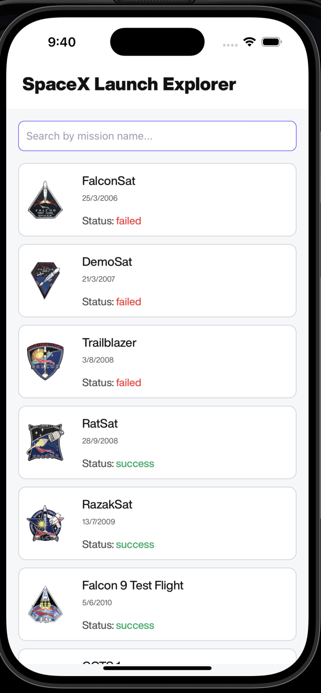
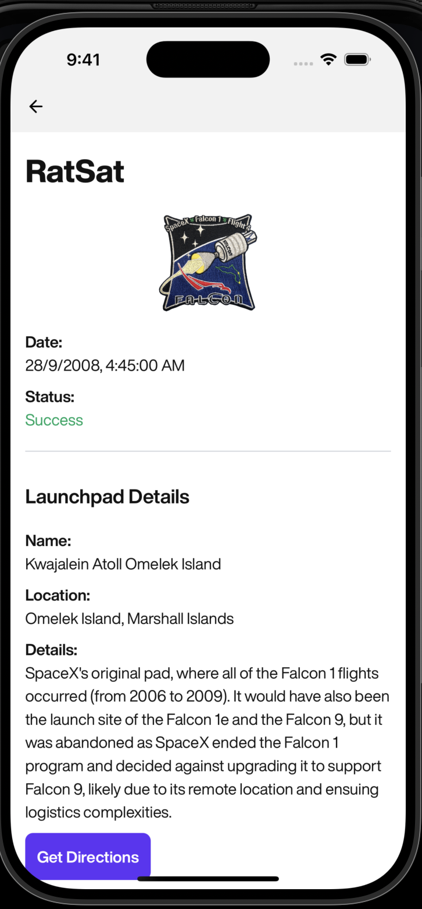
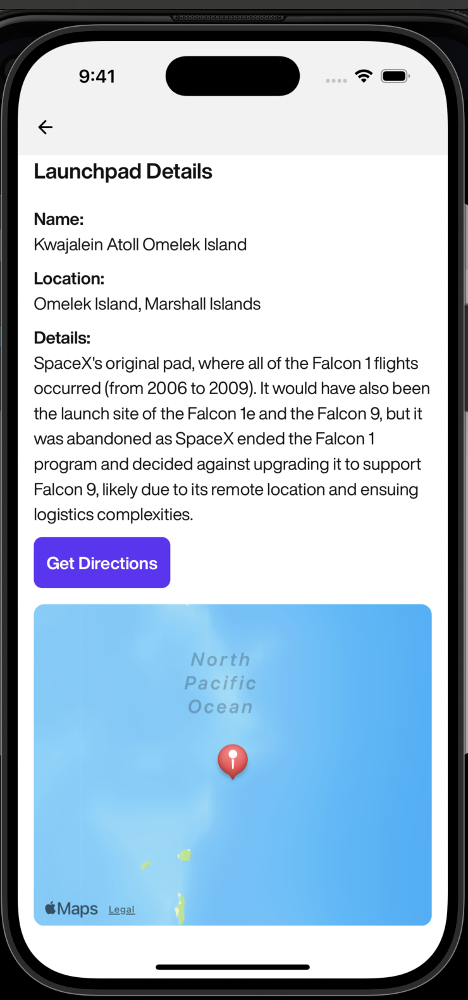

# SpaceX Launch Explorer

This is an Expo project created with `create-expo-app`, enhanced to serve as a SpaceX Launch Explorer application.

## Core User Story

"As a space enthusiast, I browse SpaceX launches, open details, and view the launchpad on a map along with my current location and distance to it."

## Features Implemented

-   **SpaceX API Integration**: Consumes `https://api.spacexdata.com/v5/launches` and `https://api.spacexdata.com/v4/launchpads/:id` for launch and launchpad data.
-   **Launch List Screen**:
    -   Infinite/paginated list (using `FlatList`) displaying mission name, date, image, and status. (Note: Pagination to be implemented fully, currently fetches all data)
    -   Client-side search by mission name.
    -   Pull-to-refresh functionality.
-   **Launch Details Screen**:
    -   Displays comprehensive launchpad information.
    -   **Map Integration**: Fully implemented using `react-native-maps` for map display and `expo-location` for device location services.
        -   Shows launchpad location on a map.
        -   Requests device location permission and displays user’s current location. Permissions are handled gracefully, informing the user if access is denied.
        -   Provides a quick action to open the native Maps app (Google Maps/Apple Maps) with directions.
-   **State Management**: Implemented using MobX for efficient and centralized state handling.
-   **Error Handling**: A global `ErrorBoundary` is implemented to catch and gracefully display UI errors, with a `logger` utility for logging.
-   **UI/UX**: Clean, modern UI with a light theme, consistent typography and spacing, and handling for empty/loading/error states.
-   **Performance**: Memoized list rows to avoid unnecessary renders.

## App Structure & Tech

-   Expo SDK 53, React Native, TypeScript
-   MobX for state management
-   React Navigation for navigation
-   `react-native-maps` for map functionality
-   `expo-location` for device location
-   `@d11/react-native-fast-image` for image display (`AppImage`)

## Get started

1.  Install dependencies

    ```bash
    npm install
    ```

2.  Start the app

    ```bash
    npx expo start
    # Or, to run directly on iOS simulator:
    yarn ios
    ```

    In the output, you'll find options to open the app in a

    -   [development build](https://docs.expo.dev/develop/development-builds/introduction/)
    -   [Android emulator](https://docs.expo.dev/workflow/android-studio-emulator/)
    -   [iOS simulator](https://docs.expo.dev/workflow/ios-simulator/)
    -   [Expo Go](https://expo.dev/go), a limited sandbox for trying out app development with Expo

## Deliverables

-   GitHub repo that runs with `npm i` and `npx expo start`.
-   README covering:
    -   **Map Implementation**: The map functionality is powered by `react-native-maps` for rendering interactive maps and `expo-location` for accessing the device's geographical location. It displays the launchpad's coordinates and optionally the user's current location.
    -   **Permission Flows and Handling**: User location permissions are requested using `expo-location`. The application gracefully handles scenarios where permissions are denied, informing the user and ensuring a smooth experience even without location access.
    -   **App Screenshots**: Screenshots of the application's key screens should be added below, showcasing the launch list, search functionality, launch details, and map view.

## App Screenshots

<div style="display: flex; flex-wrap: wrap; justify-content: space-around; gap: 10px;">
  
  
  
</div>

## Learn more

To learn more about developing your project with Expo, look at the following resources:

-   [Expo documentation](https://docs.expo.dev/): Learn fundamentals, or go into advanced topics with our [guides](https://docs.expo.dev/guides).
-   [Learn Expo tutorial](https://docs.expo.dev/tutorial/introduction/): Follow a step-by-step tutorial where you'll create a project that runs on Android, iOS, and the web.

## Join the community

Join our community of developers creating universal apps.

-   [Expo on GitHub](https://github.com/expo/expo): View our open source platform and contribute.
-   [Discord community](https://chat.expo.dev): Chat with Expo users and ask questions.# spacex-launch-explorer
